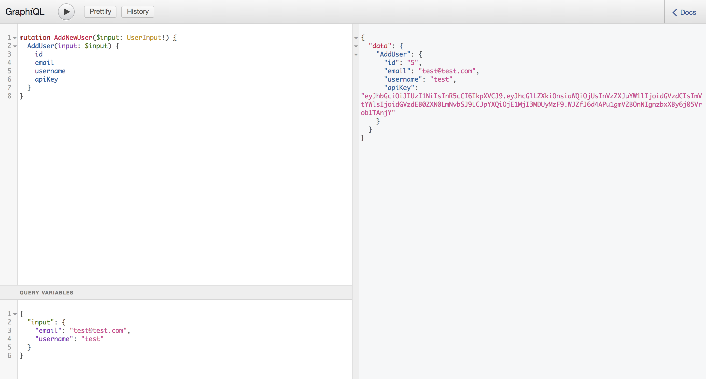
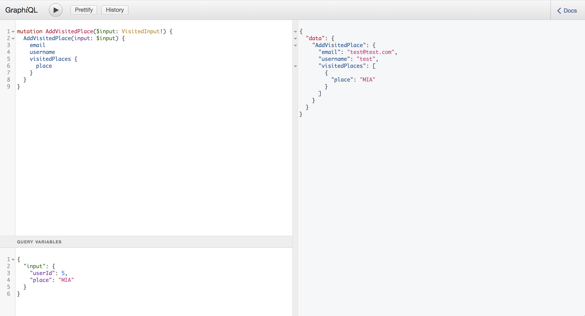
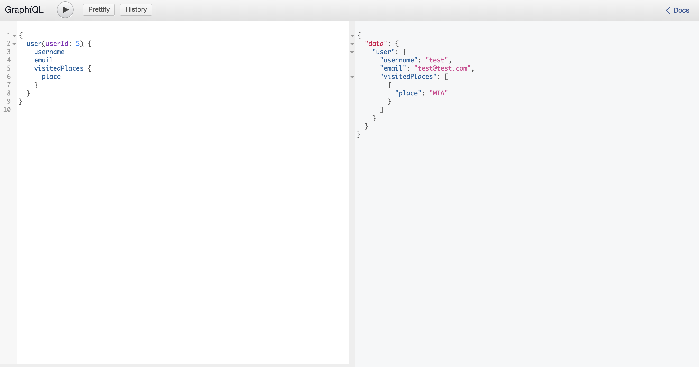

# Learn GraphQL basics

 
[](http://makeapullrequest.com)


# Step by step

[Check this post to try it step by step](https://itnext.io/create-your-first-graphql-app-and-set-an-auth-middleware-2dd841f714c2)

# How to run it
+ Clone this repo.
+ Create a pg database.
+ Replace `development.env` with your variables.
+ `npm install`.
+ `npm run dev`.
+ Visit on your browser `http://localhost:<YOUR_PORT>/graphql`.

## Load database data
After you clone this repo, go to the project folder, and run this script on the terminal; replace `YOUR_DATABASE_NAME` with the name of your database.
```shell
psql <YOUR_DATABASE_NAME> < database/pg-data.sql
```
## Mutations

### Add new user
```graphql
mutation AddNewUser($input: UserInput!) {
  AddUser(input: $input) { 
    id
    email
    username
    apiKey
  }
}
```
Variables
```graphql
{
  "input": {
    "email": "test@test.com",
    "username": "test"
  }
}
```


### Add visited place
```graphql
mutation AddVisitedPlace($input: VisitedInput!) {
  AddVisitedPlace(input: $input) {
    email
    username
    visitedPlaces {
      place
    }
  }
}
```
Variables:
```graphql
{
  "input": {
    "userId": 5,
    "place": "MIA"
  }
}
```

## Query

### Get user with visited places
```graphql
{
  user(userId: 5) {
    username
    email
    visitedPlaces {
      place
    }
  }
}
```



## License
### The MIT License

Copyright (c) 2018 Alejandro Estrada

Permission is hereby granted, free of charge, to any person obtaining a copy
of this software and associated documentation files (the "Software"), to deal
in the Software without restriction, including without limitation the rights
to use, copy, modify, merge, publish, distribute, sublicense, and/or sell
copies of the Software, and to permit persons to whom the Software is
furnished to do so, subject to the following conditions:

The above copyright notice and this permission notice shall be included in
all copies or substantial portions of the Software.

THE SOFTWARE IS PROVIDED "AS IS", WITHOUT WARRANTY OF ANY KIND, EXPRESS OR
IMPLIED, INCLUDING BUT NOT LIMITED TO THE WARRANTIES OF MERCHANTABILITY,
FITNESS FOR A PARTICULAR PURPOSE AND NONINFRINGEMENT. IN NO EVENT SHALL THE
AUTHORS OR COPYRIGHT HOLDERS BE LIABLE FOR ANY CLAIM, DAMAGES OR OTHER
LIABILITY, WHETHER IN AN ACTION OF CONTRACT, TORT OR OTHERWISE, ARISING FROM,
OUT OF OR IN CONNECTION WITH THE SOFTWARE OR THE USE OR OTHER DEALINGS IN
THE SOFTWARE.